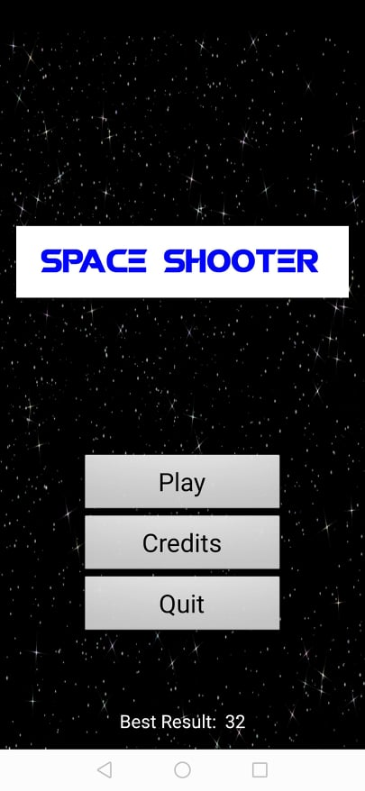
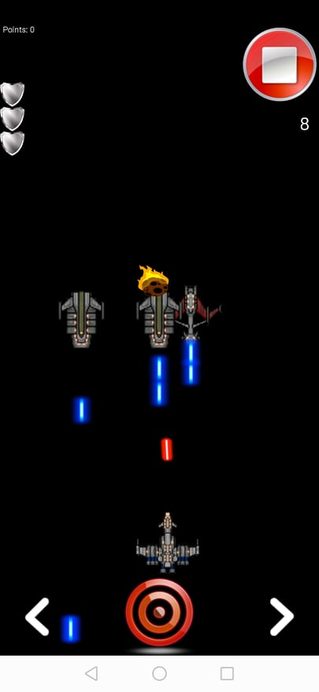

# Space Shooter mobile game

Space Shooter is a 2D mobile game where player is controling a spaceship and is trying to survive in a hostile outer space. During the game the
player has to fight with three types of enemy ships and at the same time has to avoid meteors which are constantly threatening players spaceship.

The game is built for the Android platform, but can also be ran from the Adroid Studio emulator. INheritance, polymorphism, clean code and other
best practices of Object-oriented Development are implemented in this project.

 

## Technologies

+ Java programming language

## Getting Started

In order to run the project a small amount of prerequisites and additional steps have to be fulfilled.

### Prerequisites

+ Android Studio IDE
+ SDK tools

### Running

+ Clone the project from GitHub repository
+ Open using Android Studio
+ Attach mobile device or select a virtual emulator
+ Click the `Play` button on Android Studio
+ Start the game by clicking `Play` button

